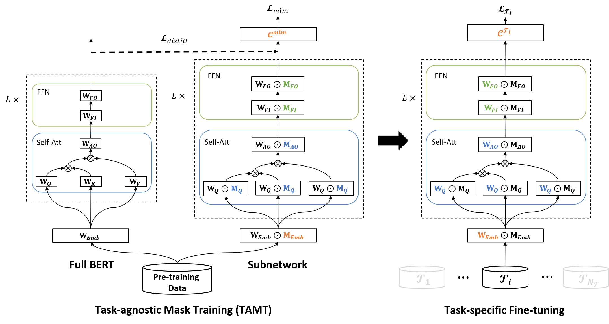
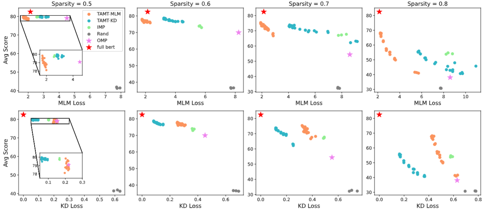

# Learning to Win Lottery Tickets in BERT Transfer via Task-agnostic Mask Training

This repository contains implementation of the [paper](https://openreview.net/forum?id=BRelke4S5l9) "Learning to Win Lottery Tickets in BERT Transfer via Task-agnostic Mask Training" in NAACL 2021.

The code for task-agnostic mask training is based on [huggingface/transformers](https://github.com/huggingface/transformers), [TinyBERT](https://github.com/huawei-noah/Pretrained-Language-Model/tree/master/TinyBERT) (for TAMT-KD) and [maskbert](https://github.com/ptlmasking/maskbert).

The code for downstream fine-tuning and IMP is modified from [BERT-Tickets](https://github.com/VITA-Group/BERT-Tickets).


## Overview

### Method: Task-Agnostic Mask Training (TAMT)

TAMT learns the subnetwork structures on the pre-training dataset, using either the MLM loss or the KD loss. The identified subnetwork is then fine-tuned on a range of downstream tasks, in place of the original BERT model.



### Pre-training and Downstream Performance

The pre-training performance of a BERT subnetwork correlates with its down-stream transferability.




## Requirements

Python3 <br />
torch>1.4.0 <br />


## Pruning and Mask Training

The following instructions use BERT-base as the example, results of RoBERTa-base can be reproduced in similar fashion.

### TAMT-MLM
The scripts for running TAMT-MLM are in the folder `mask_training/shell_scripts/train_mlm`. 

To perform TAMT-MLM on BERT-base with 0.7 sparsity, run
```
  bash mask_training/shell_scripts/train_mlm/bert/0.7.sh
```

### TAMT-KD
Before running TAMT-KD, we first need to prepare the training data by running the following command, which will store the training data to `mask_training/data/wikitext-103-kd/epoch_0.json`.
```
  bash mask_training/shell_scripts/generate_kd_data_bert.sh
```

The scripts for running TAMT-KD are in the folder `mask_training/shell_scripts/train_kd`. 

To perform TAMT-KD on BERT-base with 0.7 sparsity, run
```
  bash mask_training/shell_scripts/train_kd/bert/0.7.sh
```

### TAMT-MLM+KD
The scripts for running TAMT-MLM+KD are in the folder `mask_training/shell_scripts/train_mlm_kd`. 

To perform TAMT-MLM+KD on BERT-base with 0.7 sparsity, run
```
  bash mask_training/shell_scripts/train_mlm_kd/bert/0.7.sh
```

### Iterative Magnitude Pruning (IMP)
The scripts for IMP are in the folder `imp_and_fine_tune/shell_scripts/imp`. 

To perform IMP on BERT-base with an interval of 2,792 training steps between pruning steps, run
```
  bash imp_and_fine_tune/shell_scripts/imp/bert/prun_step2792/pretrain_imp_seed1.sh
```

### One-shot Magnitue Pruning (OMP) and Random Pruning
The scripts for OMP and random pruning are in the folder `imp_and_fine_tune/shell_scripts/oneshot`. 

To perform OMP on BERT-base, run
```
  bash imp_and_fine_tune/shell_scripts/oneshot/bert_mag.sh
```

To perform random pruning on BERT-base, run
```
  bash imp_and_fine_tune/shell_scripts/oneshot/bert_rand.sh
```


## Fine-tuning

### Full Model
To fine-tune the full BERT-base on task MNLI, run
```
  bash imp_and_fine_tune/shell_scripts/run_glue/full_bert/mnli.sh
```

### TAMT
To fine-tune the TAMT-MLM, TAMT-KD or TAMT-MLM+KD BERT-base subnetwork (0.7 sparsity) on task MNLI, run
```
  bash imp_and_fine_tune/shell_scripts/run_glue/$tamt_path/main_result/bert/mnli/0.7.sh
```
where `$tamt_path=train_mlm, train_kd or train_mlm_kd`.

### IMP
To fine-tune the IMP BERT-base subnetwork (0.7 sparsity) on task MNLI, run
```
  bash imp_and_fine_tune/shell_scripts/run_glue/imp_pretrain/bert/mnli/0.7.sh
```

### OMP
To fine-tune the OMP BERT-base subnetwork (0.7 sparsity) on task MNLI, run
```
  bash imp_and_fine_tune/shell_scripts/run_glue/oneshot/bert/mnli/0.7.sh
```

### Random Pruning
To fine-tune the randomly pruned BERT-base subnetwork (0.7 sparsity) on task MNLI, run
```
  bash imp_and_fine_tune/shell_scripts/run_glue/rand/bert/mnli/0.7.sh
```


## Evaluating MLM and KD Loss


## Mask Similarity and Distance
